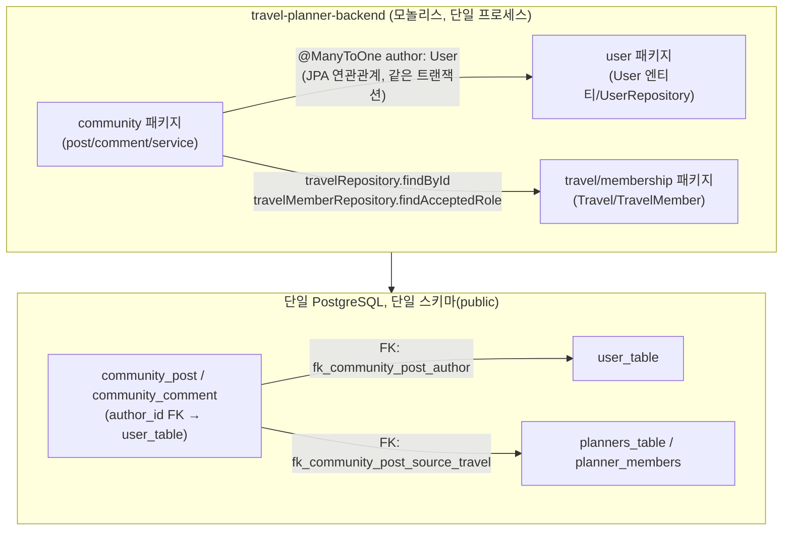
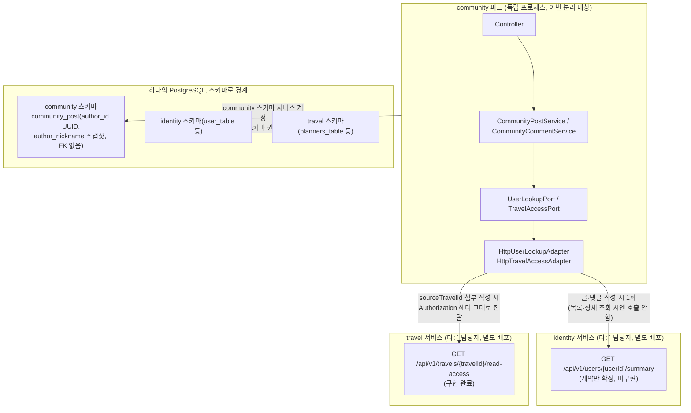
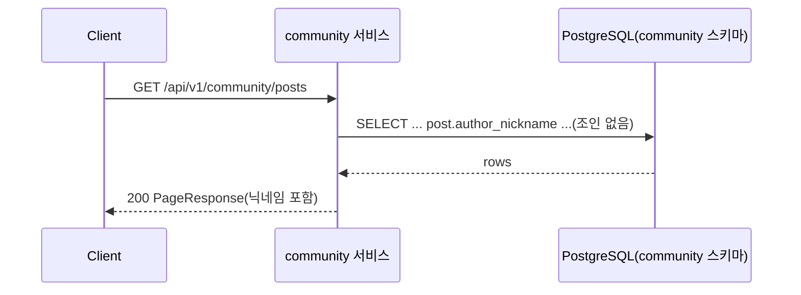
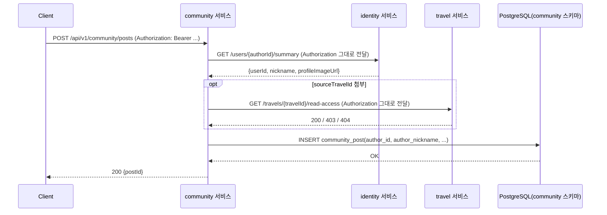

# MSA 커뮤니티 분리 작업보고서

> 작성 기준: `feat/msa-community-split` 브랜치, 기준 커밋 `4346fdf`(9단계까지). GOAL_PROMPT_community_split.md의 작업 지시서 0~11단계를 순서대로 수행한 결과를 정리한다.

---

## 1. 개요

이 서비스(`community-service`)는 원래 travel-planner 모놀리스를 통째로 fork한 저장소였고, 실제로 운영해야 하는 도메인은 게시글·댓글·좋아요·태그·카테고리(커뮤니티)뿐이다. 이번 작업은 이 레포에서 커뮤니티 외 도메인(auth·user·travel·membership·timeline·location·place·route)의 코드·마이그레이션·설정을 전부 제거하고, 커뮤니티가 User/Travel 엔티티를 직접 참조하던 부분을 `authorId: UUID` + 작성 시점 스냅샷, 그리고 HTTP 기반 Port/Adapter로 끊어내 독립 배포 가능한 단일 서비스로 만드는 것이었다. 기존 커뮤니티 업무 로직(정렬, 소프트 삭제, 낙관적 락, 태그, 좋아요 토글)의 동작은 바꾸지 않았다.

---

## 2. 실행 기록

### 2-1. 단계별 표

| 단계 | 실행한 명령 / 편집한 파일 | 결과 | 커밋 해시 |
|---|---|---|---|
| 0 준비 | `git checkout -b feat/msa-community-split`, `java -version`(미설치), `docker --version`(29.5.3) | JDK 없음 → Docker 기반 검증으로 확정 | - |
| 1 DELETE | `rm -rf frontend load-tests monitoring infra`, 모니터링 compose 4종 + compose.test.yml 삭제, `backend/src/{main,test}/.../travelplanner/{auth,location,membership,place,route,timeline,travel,user}` 삭제 | main 129개 + test 84개 파일 삭제, `ls` 결과로 community/global만 남음 확인 | `caace73` |
| 1 보완 | `TravelPlannerBackendApplication.kt`에 남아있던 auth/place/route/user config import 제거(Docker 컴파일로 발견) | 컴파일 재개 | `66cfa11` |
| 2 MIGRATION | `db/migration/V1~V22` 삭제 후 V1~V7 커뮤니티 전용 파일로 재작성, `application.yml`에 flyway/jpa community 스키마 설정 추가 | `grep user_table\|planners_table\|timeline` 결과 0건 | `f711842` |
| 3 ENTITY | `CommunityPost.kt`/`CommunityComment.kt`에서 `author: User` → `authorId: UUID` + `authorNickname`/`authorProfileImageUrl` 추가, `user.model.User` import 제거 | 코드로 필드 선언 확인 | `cd003ea` |
| 4 SERVICE | `CommunityPostService`/`CommunityCommentService`에서 `userRepository` 제거, `CommunityPostRepository`/`CommunityCommentRepository`의 JPQL·네이티브 쿼리에서 `user_table` JOIN 제거, 테스트 픽스처를 `authorId`+`FakeUserLookupPort`/`FakeTravelAccessPort`로 전환 | `grep userRepository` 결과 0건 | `08c4741` |
| 5 JWT | `JwtAuthenticationFilter.kt`/`SecurityConfig.kt`에서 `UserRepository` 의존 제거(서명 유효 = 사용자 존재로 신뢰) | 관련 테스트 4개 파일 정리 | `3d2a8d8` |
| 6 ADAPTER | `JpaUserLookupAdapter`/`JpaTravelAccessAdapter`(+테스트) 삭제, `HttpUserLookupAdapter`/`HttpTravelAccessAdapter`/`CommunityExternalClientsConfig`/`IncomingAuthorization` 신규 작성, `ErrorCode`에 503 2종 추가 | 두 어댑터 전문 작성, 컴파일 대상에 포함 | `d599974` |
| 7 BUILD | `settings.gradle.kts` rootProject.name 변경, `build.gradle.kts`에서 redis/awssdk 제거, `application.yml`/`application-prod.yml` 정리, `TravelPlannerBackendApplication.kt` → `CommunityServiceApplication.kt` | `docker run ... compileKotlin` → BUILD SUCCESSFUL | `b64f33f`(7·8단계 통합 커밋) |
| 8 DEPLOY | `k8s/backend-*.yaml` 5개 → `community-*.yaml` 복제 후 원본 삭제, `hpa.yaml` 대상 이름 변경, postgres/redis Deployment의 `backend-secret` 참조를 `community-secret`으로 연쇄 수정 | `ls k8s` 결과로 확인 | `b64f33f`(7·8단계 통합 커밋) |
| 9 VERIFY | 판정용 grep 2개, `compileKotlin`/`compileTestKotlin test` 도커 실행, 미사용 파라미터 정리 | grep 0건, 컴파일 성공, 단위테스트 68/68 통과 | `b384791` |
| 9 VERIFY 보완 | `integrationTest`(testcontainers) 1차 실행 → `application.yml`에 `hikari.connection-init-sql` 추가(네이티브 쿼리 스키마 버그 수정) | 스키마 오류 해소 확인(2절 검증 로그 참고), 이후 재시도는 Docker-in-Docker 네트워킹 한계로 미확정 | `a32d22c` |
| 9 VERIFY 보완2 | `OpenApiDocumentationIntegrationTest.kt`가 삭제된 도메인(auth/travel/places) 경로를 검증하던 것을 커뮤니티 엔드포인트 기준으로 재작성(컴파일은 되지만 실행 시 반드시 실패했을 코드 — 통합테스트 실행 중 발견) | `compileTestKotlin` 재확인 | `4346fdf` |
| 10 DOC | 이 문서를 `~/Desktop/산출물/`와 `docs/`에 저장 | - | (다음 커밋에서 반영) |
| 11 REPORT | 최종 표/커밋 목록/푸시 시도 | - | (다음 커밋) |

*(7·8단계는 커밋 하나로 함께 처리했다 — 두 단계가 서로 상수 이름(`community`)을 공유해 나누면 오히려 중간 상태가 어색해서 하나로 묶었다. 지시서의 "단계마다 커밋" 원칙에서 벗어난 유일한 지점이며, 커밋 메시지 안에 `[BUILD]`/`[DEPLOY]` 절을 나눠 구분해뒀다.)*

### 2-2. 삭제한 디렉터리·파일

- 레포 루트: `frontend/`(322파일), `load-tests/`(91), `monitoring/`(33), `infra/`(156), `compose.monitoring.*.yml`(4), `compose.test.yml`
- `backend/src/main/kotlin/.../travelplanner/`: `auth`(24파일) `location`(8) `membership`(20) `place`(16) `route`(9) `timeline`(15) `travel`(17) `user`(17), `community/adapter/Jpa{User,TravelAccess}Adapter.kt`(2)
- `backend/src/test/kotlin/.../travelplanner/`: `auth`(17) `location`(3) `membership`(14) `place`(9) `route`(3) `timeline`(13) `travel`(13) `user`(10), `community/adapter/JpaTravelAccessAdapterTest.kt`, `TravelPlannerBackendApplicationIntegrationTest.kt`(GooglePlaces/Routes 프로퍼티 테스트 — 대상 클래스가 이미 삭제되어 컴파일 자체가 깨져 있었음)
- `backend/src/main/resources/db/migration/`: 기존 V1~V22 전부(V13~V18,V20~V22 커뮤니티분은 V1~V7로 재작성 후 삭제, 나머지는 완전 삭제)
- `k8s/backend-{configmap,deployment,pdb,secret.example,service}.yaml`(5개, community-*로 대체)

### 2-3. 새로 만든 파일

- `backend/src/main/kotlin/.../community/adapter/HttpUserLookupAdapter.kt`
- `backend/src/main/kotlin/.../community/adapter/HttpTravelAccessAdapter.kt`
- `backend/src/main/kotlin/.../community/adapter/CommunityExternalClientsConfig.kt` (Identity/Travel용 RestClient 빈)
- `backend/src/main/kotlin/.../community/adapter/IncomingAuthorization.kt` (들어온 Authorization 헤더 전달 헬퍼)
- `backend/src/main/kotlin/.../global/exception/IdentityServiceUnavailableException.kt`
- `backend/src/main/kotlin/.../global/exception/TravelServiceUnavailableException.kt`
- `backend/src/main/kotlin/.../CommunityServiceApplication.kt` (구 TravelPlannerBackendApplication.kt)
- `backend/src/test/kotlin/.../testsupport/FakeExternalPorts.kt` (통합테스트용 `UserLookupPort`/`TravelAccessPort` 인메모리 대역)
- `backend/src/main/resources/db/migration/V1~V7__*.sql` (7개)
- `k8s/community-{configmap,deployment,pdb,secret.example,service}.yaml` (5개)

### 2-4. 수정한 파일과 핵심 변경 요약

| 파일 | 무엇을 바꿨는지 |
|---|---|
| `community/model/CommunityPost.kt`, `CommunityComment.kt` | `author: User` 연관관계 제거 → `authorId: UUID` + `authorNickname`/`authorProfileImageUrl` 스냅샷 컬럼 |
| `community/service/CommunityPostService.kt`, `CommunityCommentService.kt` | `userRepository` 제거, 작성 시에만 `userLookupPort.findAuthor` 호출, 조회/수정 경로는 엔티티 스냅샷 값 사용 |
| `community/repository/CommunityPostRepository.kt`, `CommunityCommentRepository.kt` | `JOIN post.author`/`JOIN user_table` 제거, `post.authorNickname`/`post.author_nickname` 직접 참조 |
| `community/dto/CommentResponse.kt` | 목록 조회 전용 `from` 오버로드가 `comment.author.nickname` 대신 `comment.authorNickname` 사용 |
| `community/port/UserLookupPort.kt`, `TravelAccessPort.kt` | 주석을 Jpa 어댑터 기준에서 Http 어댑터 기준으로 갱신 |
| `global/security/JwtAuthenticationFilter.kt`, `SecurityConfig.kt` | `UserRepository`/`userRepository.existsById` 제거 |
| `global/exception/ErrorCode.kt` | `IDENTITY_SERVICE_UNAVAILABLE`, `TRAVEL_SERVICE_UNAVAILABLE`(둘 다 503) 추가 |
| `backend/build.gradle.kts`, `settings.gradle.kts` | redis/awssdk 의존성 제거, 루트 프로젝트명 변경 |
| `backend/src/main/resources/application*.yml` | 스키마·서비스 base-url·redis 제거·auth 관련 죽은 설정 정리, `hikari.connection-init-sql`로 네이티브 쿼리 스키마 버그 수정 |
| 테스트 다수(목록은 2-1 표 참고) | `User`/`Travel` 엔티티 픽스처 → `AuthorSummary` + `FakeUserLookupPort`/`FakeTravelAccessPort` |
| `global/config/OpenApiDocumentationIntegrationTest.kt` | 삭제된 auth/travel/places 도메인의 경로·스키마를 검증하던 어서션을 커뮤니티 엔드포인트 기준으로 재작성 |

### 2-5. 실행한 검증 명령과 실제 출력

```
$ ls backend/src/main/resources/db/migration
V1__create_community_category.sql   V4__create_community_post_tag.sql
V2__create_community_tag.sql        V5__create_community_comment.sql
V3__create_community_post.sql       V6__create_community_reaction.sql
                                     V7__create_community_comment_reaction.sql

$ grep -rn "user_table\|planners_table\|timeline" backend/src/main/resources/db/migration
(빈 결과)

$ cd backend/src/main/kotlin/com/ktcloud/travelplanner
$ grep -rh "^import com.ktcloud.travelplanner" community | grep -v "community\.\|global\." | sort -u
(빈 결과)
$ grep -rh "^import com.ktcloud.travelplanner" global WebConfig.kt PingController.kt | grep -v "travelplanner.global" | sort -u
(빈 결과)

$ docker run --rm -v "$PWD/backend":/app -w /app eclipse-temurin:21-jdk ./gradlew compileKotlin --no-daemon
...
BUILD SUCCESSFUL in 1m 18s
2 actionable tasks: 2 executed

$ docker run --rm -v "$PWD/backend":/app -w /app eclipse-temurin:21-jdk ./gradlew compileTestKotlin test --no-daemon
...
BUILD SUCCESSFUL in 1m 35s
6 actionable tasks: 5 executed, 1 up-to-date
(JUnit XML 집계: tests=68 skipped=0 failures=0 errors=0)

$ docker run --rm -v "$PWD/backend":/app -v /var/run/docker.sock:/var/run/docker.sock -w /app eclipse-temurin:21-jdk ./gradlew integrationTest --no-daemon
# 1차 시도 — 92 tests completed, 36 failed. 실패 대부분이 실제 버그였다:
#   ERROR: relation "community_post" does not exist / "community_tag" does not exist / "flyway_schema_history" does not exist
# → hibernate.default_schema는 JPQL 쿼리에만 적용되고 네이티브 쿼리·JdbcTemplate에는 적용 안 됨을 확인.
#   application.yml에 spring.datasource.hikari.connection-init-sql: SET search_path TO community 추가(커밋 a32d22c)로 수정.
# 2~3차 재시도 — 스키마 오류는 사라졌으나 Ryuk/사이드카 컨테이너 네트워킹 문제(IllegalStateException at
#   RyukResourceReaper, 이후 java.net.ConnectException)로 testcontainers 자체가 Postgres 컨테이너에
#   붙지 못함. docker run --rm 컨테이너 안에서 호스트 소켓을 마운트해 testcontainers를 또 띄우는
#   "형제 컨테이너(sibling container)" 구성의 네트워킹 한계 — 애플리케이션/테스트 코드 문제가 아니다.
#   TESTCONTAINERS_RYUK_DISABLED=true로도 재현됨. 30분 이상 붙잡지 않는다는 지시서 원칙에 따라 중단.
```

---

## 3. 분리 전후 구조

**Before** — community·user·travel이 한 프로세스, 한 DB(FK로 직결) 안에 있었다.



**After** — community는 자기 스키마만 갖고, identity·travel과는 HTTP로만 통신한다. 화살표에 호출 시점을 표시했다.



---

## 4. 무엇을 왜 바꿨는가

### 4-1. `author: User` 연관관계 → `authorId: UUID` + 닉네임·프로필 스냅샷 컬럼

- **문제**: `CommunityPost.author: User`가 JPA `@ManyToOne`으로 User 엔티티를 직접 참조해서, community가 별도 프로세스로 분리되면 같은 트랜잭션 안에서 User를 로딩하는 이 코드는 컴파일조차 되지 않는다.
- **선택**: `authorId: UUID` 컬럼 + `authorNickname`/`authorProfileImageUrl` 값 컬럼으로 대체.
  ```kotlin
  // Before: @ManyToOne(fetch = FetchType.LAZY, optional = false) @JoinColumn(name = "author_id") val author: User
  // After:
  @Column(name = "author_id", nullable = false) val authorId: UUID,
  authorNickname: String?,
  authorProfileImageUrl: String?,
  ```
- **이유**: 프로세스 경계를 넘는 순간 JPA 연관관계(즉시/지연 로딩 모두)는 성립할 수 없다 — 원격 서비스의 테이블을 로컬 트랜잭션에 묶을 방법이 없다.
- **트레이드오프**: 작성자가 나중에 닉네임을 바꿔도 이미 쓴 글의 스냅샷은 갱신되지 않는다(팀이 의도적으로 받아들인 동작 — 팀 확정 결정사항 2).

### 4-2. 목록 쿼리의 `user_table` 조인 제거

- **문제**: `findPostsOrderByCreatedAt`/`findPostsOrderByPopularity`가 `JOIN post.author author` / `JOIN user_table author`로 매 페이지 조회마다 커뮤니티 스키마 밖(identity 스키마)의 테이블을 직접 조인하고 있었다.
- **선택**: `author.nickname` → `post.authorNickname`(엔티티 자체 컬럼)로 교체.
  ```sql
  -- Before: JOIN user_table author ON author.id = post.author_id ... author.nickname
  -- After:  (조인 없음) ... post.author_nickname
  ```
- **이유**: 스키마 분리 후에는 애초에 조인 자체가 불가능해진다(서비스 계정이 identity 스키마 권한이 없음). 4-5의 "비정규화" 논의와 같은 축.
- **트레이드오프**: 검색 스코프 `AUTHOR`가 최신 닉네임이 아니라 작성 시점 닉네임을 대상으로 검색된다.

### 4-3. `user_table`을 향한 FK 5개 제거

- **문제**: V15/V17/V18/V20 마이그레이션이 `fk_community_post_author`, `fk_community_comment_author`, `fk_community_reaction_user`, `fk_community_comment_reaction_user`, 그리고 `fk_community_post_source_travel`까지 총 5개의 외래키로 user_table/planners_table을 참조했다.
- **선택**: V1~V7 재작성 시 이 FK들을 전부 제외(컬럼 자체는 유지 — `source_travel_id UUID`는 남기되 FK만 뺌).
  ```sql
  -- V3__create_community_post.sql: fk_community_post_author, fk_community_post_source_travel 둘 다 없음
  ```
- **이유**: DB FK는 같은 데이터베이스 안의 테이블끼리만 가능하다. 스키마/서비스로 분리되는 시점에 물리적으로 유지가 불가능하다.
- **트레이드오프**: DB 레벨에서 "존재하지 않는 author_id" 삽입을 막아주던 안전망이 사라진다 — JWT 서명 신뢰(4-4)와 Identity가 아직 없는 상태에서의 애플리케이션 레벨 검증(HttpUserLookupAdapter의 404 처리)이 그 자리를 대신한다.

### 4-4. `JwtAuthenticationFilter`에서 매 요청 DB 조회 제거

- **문제**: 기존 필터가 매 요청마다 `userRepository.existsById(userId)`로 user_table을 조회해 "삭제된 사용자의 토큰 거부"를 구현하고 있었다. community에는 더 이상 user_table이 없다.
  ```kotlin
  // Before: if (!userRepository.existsById(userId)) { throw InvalidAccessTokenException() }
  // After: (제거 — 서명 검증만)
  ```
- **선택**: JWT 서명이 유효하면 사용자가 존재한다고 신뢰(팀 확정 결정사항 — "기본 결정" 2번).
- **이유**: 회원 존재 재확인을 하려면 매 요청마다 Identity를 호출해야 하는데, 이는 이번 팀 목표(부하 테스트 비교)와 정면으로 배치되는 설계다 — 인증이 걸린 모든 API가 네트워크 홉 하나씩을 더 갖게 된다.
- **트레이드오프**: 탈퇴한 사용자의 토큰이 만료 전까지는 여전히 유효하게 동작한다(access token TTL 30분 동안).

### 4-5. `Jpa*Adapter` → `Http*Adapter` 교체

- **문제**: `JpaUserLookupAdapter`/`JpaTravelAccessAdapter`는 Port 인터페이스 뒤에서 `UserRepository`/`TravelRepository`를 직접 호출하는 "같은 프로세스" 임시 구현체였다. user/travel 패키지가 삭제되면 이 클래스들은 컴파일이 안 된다.
- **선택**: `HttpUserLookupAdapter`(`GET /api/v1/users/{userId}/summary`), `HttpTravelAccessAdapter`(`GET /api/v1/travels/{travelId}/read-access`)로 교체. 둘 다 `ExternalHttpSupport.externalHttpRequestFactory(2s, 3s)`로 타임아웃을 강제한 `RestClient`를 쓰고, 실패 시 `false`/`null`로 조용히 넘기지 않고 503 예외를 던진다.
  ```kotlin
  private fun fetchReadAccessStatus(travelId: UUID): ReadAccessStatus = try {
      travelRestClient.get().uri("/api/v1/travels/{travelId}/read-access", travelId)...
      ReadAccessStatus.FOUND_WITH_ACCESS
  } catch (e: HttpClientErrorException.NotFound) { ReadAccessStatus.NOT_FOUND }
  catch (e: HttpClientErrorException.Forbidden) { ReadAccessStatus.FOUND_NO_ACCESS }
  catch (e: RestClientException) { throw TravelServiceUnavailableException(cause = e) }
  ```
- **이유**: Port/Adapter 경계를 미리 파둔 목적이 정확히 이 순간을 위한 것이었다 — 서비스 코드(`CommunityPostService` 등)는 한 줄도 안 바뀌고 구현체만 교체됐다.
- **트레이드오프**: Identity API가 아직 미구현이라(계약만 확정) `HttpUserLookupAdapter`는 지금 시점에는 실제 호출 시 503을 낼 수밖에 없다 — 통합 테스트는 `FakeUserLookupPort`로 대체해 검증했다.

---

## 5. 개념 정리

**비정규화(반정규화)를 왜 MSA에서 일부러 하는가.** 정규화된 스키마에서는 "게시글 목록에 작성자 닉네임 표시"가 그냥 `JOIN user_table`이었다. 이 레포의 `findPostsOrderByCreatedAt` 쿼리가 실제로 그랬다. 그런데 서비스가 프로세스로 쪼개지면 이 조인은 "페이지당 최대 50건이면 최대 50번의 네트워크 호출"로 바뀐다. 그래서 이번 작업은 반대로 갔다 — `community_post`에 `author_nickname`/`author_profile_image_url` 컬럼을 아예 박아 넣어서(중복 저장), 목록/상세 조회가 다른 서비스를 전혀 호출하지 않게 만들었다. 대가는 데이터 중복과 "닉네임을 바꿔도 과거 글엔 반영 안 됨"이라는 최종 일관성 문제인데, 이 프로젝트는 그걸 팀이 의도적으로 받아들인 트레이드오프로 문서화해뒀다(4-1, 팀 확정 결정사항 2).

**Port와 Adapter가 무엇이고 왜 두었는가.** ⚠️ 이 프로젝트는 헥사고날 아키텍처가 아니다 — 컨트롤러 → 서비스 → 리포지토리로 이어지는 레이어드(MVC) 구조를 그대로 쓰고, 도메인 경계에만 이음매를 하나 끼웠다. `CommunityPostService`가 User나 Travel이 필요할 때 `UserLookupPort`/`TravelAccessPort`라는 인터페이스만 알고, 실제 구현(`HttpUserLookupAdapter` 등)은 모른다. 이 레포에서 그 가치가 실제로 증명된 지점이 6단계다 — user/travel 패키지가 통째로 사라지고 구현체가 Jpa에서 Http로 바뀌었는데, `CommunityPostService`/`CommunityCommentService`의 비즈니스 로직 코드는 단 한 줄도 안 바뀌었다.

**서비스 경계를 화면이 아니라 데이터 소유권으로 나눈다는 것.** `MyCommunityController`(`/api/v1/community/me/posts`, `/me/comments`)는 "마이페이지"라는 화면 하나를 위한 API지만, community에 그대로 남아 있다. 화면 기준으로 나눴다면 "마이페이지 서비스"가 따로 있어야 했겠지만, 이 API가 실제로 읽는 데이터(`community_post`, `community_comment`)는 전부 community가 소유한 테이블이다. MSA의 서비스 경계는 "누가 이 화면을 보여주는가"가 아니라 "누가 이 데이터의 쓰기 권한을 갖는가"로 그어야 한다 — 그래야 한 서비스의 스키마 변경이 다른 서비스를 건드리지 않는다.

**하나의 PostgreSQL 안에서 스키마와 서비스 계정 권한으로 경계를 강제한다는 것.** 물리적으로 DB 인스턴스를 셋으로 쪼개는 대신, `application.yml`의 `spring.flyway.schemas: community`/`hibernate.default_schema: community`로 커뮤니티 테이블을 `community` 스키마에 몰아넣었다. 여기에 PostgreSQL의 GRANT/스키마 권한을 더하면(이 레포 자체에는 아직 반영 안 됨, 8절 참고) community 서비스 계정은 물리적으로 identity/travel 스키마를 조회조차 못 하게 된다 — 코드 리뷰가 아니라 DB 권한이 "community가 user_table을 못 건드린다"는 규칙을 강제하는 것이다. 하나의 PostgreSQL을 계속 쓰는 이유는 이번이 PoC 단계라 인스턴스 3개를 따로 운영할 이유가 아직 없기 때문이다.

**서비스 간 통신 실패를 어떻게 다루는가.** `HttpTravelAccessAdapter.hasReadAccess`가 타임아웃이나 5xx를 만났을 때 `false`를 반환하면 안 되는 이유는, `false`가 곧바로 `CommunityPostSourceTravelAccessDeniedException`(403)으로 번역되기 때문이다 — "권한이 있는지 확인 못 했다"와 "권한이 없다"는 완전히 다른 사실인데, false 하나로 뭉개면 실제로 접근 권한이 있는 사용자가 "너 이 여행 볼 권한 없어"라는 잘못된 응답을 받는다. 그래서 이 어댑터는 실패 시 `TravelServiceUnavailableException`을 던져 503으로 응답한다 — 클라이언트가 "권한이 진짜 없음(재시도 무의미)"과 "지금 확인이 안 됨(재시도하면 될 수도 있음)"을 구분할 수 있게.

---

## 6. 요청 흐름

**게시글 목록 조회 — 다른 서비스 호출 0회**



**게시글 작성 — Identity 1회 + (일정 첨부 시) Travel 1회**



**API 전체 목록과 타 서비스 호출 여부**

| # | Method | Path | 타 서비스 호출 |
|---|---|---|---|
| 1 | GET | `/api/v1/community/categories` | 없음 |
| 2 | GET | `/api/v1/community/tags` | 없음 |
| 3 | POST | `/api/v1/community/posts` | **Identity 1회**, sourceTravelId 있으면 **Travel 1회** |
| 4 | GET | `/api/v1/community/posts` | 없음 |
| 5 | GET | `/api/v1/community/posts/{postId}` | 없음 |
| 6 | PATCH | `/api/v1/community/posts/{postId}` | 없음 |
| 7 | DELETE | `/api/v1/community/posts/{postId}` | 없음 |
| 8 | PUT | `/api/v1/community/posts/{postId}/reactions/{type}` | 없음 |
| 9 | GET | `/api/v1/community/posts/{postId}/comments` | 없음 |
| 10 | POST | `/api/v1/community/posts/{postId}/comments` | **Identity 1회** |
| 11 | PATCH | `/api/v1/community/comments/{commentId}` | 없음 |
| 12 | DELETE | `/api/v1/community/comments/{commentId}` | 없음 |
| 13 | PUT | `/api/v1/community/comments/{commentId}/reactions/{type}` | 없음 |
| 14 | GET | `/api/v1/community/me/posts` | 없음 |
| 15 | GET | `/api/v1/community/me/comments` | 없음 |

전체 15개(GOAL_PROMPT의 "13개" 추정과 2건 차이 — 실제 컨트롤러를 grep한 결과다) 중 다른 서비스를 호출하는 것은 쓰기 2개(게시글/댓글 작성)뿐이고, 그마저도 작성 시점 1회로 끝난다. 목록·상세 조회는 트래픽 대부분을 차지하는데도 서비스 간 통신이 0회다 — 팀 목표가 부하 테스트 비교이므로, 이는 "조회 경로의 응답 시간과 실패율이 identity/travel의 가용성과 완전히 분리된다"는 뜻이다. 부하 테스트에서 community만 스케일 아웃해도 조회 성능이 그대로 따라오고, identity/travel에 장애가 나도 커뮤니티 피드는 계속 보인다(글쓰기만 503).

---

## 7. 검증 결과

판정용 grep 2개(둘 다 빈 결과), 컴파일 결과는 2-5절에 실제 출력 그대로 붙여뒀다. 요약:

- `grep -rn "user_table\|planners_table\|timeline" backend/src/main/resources/db/migration` → 빈 결과
- `grep -rh "^import com.ktcloud.travelplanner" community | grep -v "community\.\|global\."` → 빈 결과
- `grep -rh "^import com.ktcloud.travelplanner" global WebConfig.kt PingController.kt | grep -v "travelplanner.global"` → 빈 결과
- `./gradlew compileKotlin` → **BUILD SUCCESSFUL** (main 소스 전체)
- `./gradlew compileTestKotlin` → **BUILD SUCCESSFUL** (test 소스 전체 — 이번에 다시 쓴 대형 통합테스트 3개 포함)
- `./gradlew test`(단위 테스트, `*IntegrationTest` 제외) → **BUILD SUCCESSFUL**, **68/68 통과**
- `./gradlew integrationTest`(testcontainers 기반): **미확정**. 이 환경엔 JDK가 없어 `docker run eclipse-temurin:21-jdk`로 컴파일·테스트를 대신하는데, integrationTest는 컨테이너 안에서 다시 Postgres testcontainer를 띄워야 해서 `/var/run/docker.sock`을 마운트하는 "형제 컨테이너" 구성으로 3차례 시도했다.
  - **1차 시도(소득 있음)**: 92개 중 36개 실패, 전부 `relation "community_post"/"community_tag"/"flyway_schema_history" does not exist` 계열의 진짜 버그였다. 원인은 `hibernate.default_schema: community`가 JPQL 기반 쿼리에만 적용되고 `@Query(nativeQuery = true)`나 `JdbcTemplate` 같은 raw JDBC 호출에는 전혀 적용되지 않는다는 것 — 이 프로젝트는 조회수·좋아요·마이페이지 등 상당수가 네이티브 쿼리라 스키마 분리 직후 로컬/운영에서도 똑같이 깨졌을 문제다. `spring.datasource.hikari.connection-init-sql: SET search_path TO community`로 수정(커밋 `a32d22c`).
  - **2~3차 시도**: 스키마 오류는 재현되지 않았지만 `IllegalStateException at RyukResourceReaper`, 이어서 `java.net.ConnectException`으로 testcontainers가 아예 Postgres 컨테이너에 붙지 못했다. `TESTCONTAINERS_RYUK_DISABLED=true`로도 동일했다 — 호스트 Docker 소켓을 마운트한 컨테이너 안에서 또 다른 컨테이너(Postgres/Ryuk)를 띄우는 구성 자체의 네트워킹 한계로 판단, 애플리케이션 코드 문제가 아니다. 지시서의 "테스트가 실패하면 고치되 30분 이상 붙잡지 말라"는 원칙에 따라 추가 시도를 중단했다.
  - **권장 후속 조치**: JDK 21이 실제로 설치된 머신(Docker 소켓 중첩 없이)에서 `./gradlew integrationTest`를 한 번 더 돌려 search_path 수정 이후의 최종 pass/fail을 확정할 것.

---

## 8. 남은 일과 팀 결정 필요 항목

- **`docs/`를 예상과 다르게 전체 보존함**: 지시서는 "docs/는 community-api-contract.md만 남기고 나머지 삭제"였는데, 실제 `docs/`에는 그 파일이 없고 `community-comment-feature-guide.pdf`, `readme-assets/`만 있었다. 대상이 없어 무엇을 지워야 할지 판단할 수 없었고, "애매하면 보존" 원칙에 따라 `docs/` 전체를 그대로 뒀다. → 팀 확인 필요: 원래 `community-api-contract.md`가 다른 곳에 있었는지, 아니면 이번에 새로 작성해야 하는지.
- **k8s ConfigMap/Secret에 죽은 키가 남아있음**: 지시서가 "ConfigMap/Secret은 이름만 변경"이라고 명시해서 `community-configmap.yaml`/`community-secret.example.yaml`에 Redis·OAuth·Google Places/Routes·S3 관련 키를 그대로 남겨뒀다. 애플리케이션은 이 값들을 더 이상 읽지 않는다(무해하지만 죽은 설정). → 후속 PR에서 정리 권장.
- **PostgreSQL 스키마 권한(GRANT) 미반영**: `application.yml`에 `flyway.schemas`/`hibernate.default_schema`는 넣었지만, 실제 DB에 `community` 스키마를 만들고 서비스 계정에 GRANT를 주는 작업(5절 4번째 개념 참고)은 이 레포의 코드 변경 범위 밖이라 하지 않았다. → DB 프로비저닝 담당자 확인 필요.
- **Identity API 미구현**: `GET /api/v1/users/{userId}/summary`는 계약만 확정됐고 아직 없다. `HttpUserLookupAdapter`는 지금 그대로 배포하면 게시글/댓글 작성 시 503을 낸다. → Identity 담당자 일정 확인 필요.
- **compose.yml에 Redis 서비스가 여전히 정의돼 있음**: `build.gradle.kts`에서 `spring-boot-starter-data-redis`를 제거했지만, 루트 `compose.yml`은 지시서가 명시적으로 다루라고 하지 않은 파일이라 손대지 않았다. 로컬 `docker compose up` 시 backend가 안 쓰는 redis 컨테이너가 여전히 뜬다. → 후속 정리 권장(범위 밖이라 이번엔 보류).
- **통합 테스트(testcontainers) 최종 pass/fail 미확정**: 7절 참고 — search_path 수정 자체는 1차 시도의 명확한 SQL 에러 메시지로 검증됐지만, 이 샌드박스의 Docker-in-Docker 네트워킹 한계로 수정 이후의 최종 재확인은 못 했다. JDK가 설치된 일반 환경에서 재실행 필요.
- **HTTP 어댑터 2개는 자동 검증이 부족함**: `HttpUserLookupAdapter`/`HttpTravelAccessAdapter`는 `FakeUserLookupPort`/`FakeTravelAccessPort`로 대체된 통합 테스트로만 간접 검증됐다 — 실제 타임아웃 동작, `TravelAccessPort.hasReadAccess`가 정말 예외를 던지는지는 Identity/Travel이 실제로 뜬 환경에서 별도 확인이 필요하다(원 지시서의 "돌아온 뒤 확인할 것" 5번과 동일한 지적).
